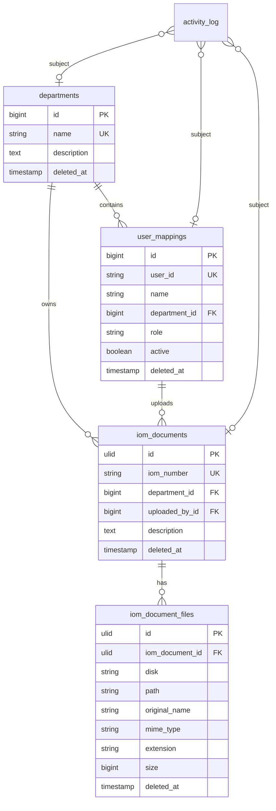

# IOM Management System Architecture

## Scope

IOM Management System is a focused document management system for Internal Office Memo files. It supports upload, storage, search, management, download through controllers, and activity audit. It intentionally excludes approval, workflow, disposition, status, and notification behavior.

## ERD

## Key Decisions

- EGIS authentication is represented by `ValidateUser`, `UserValidationService`, `CurrentUserService`, and `CurrentUserData`; Laravel Auth login is not used.
- `user_mappings` is local metadata only. It controls local role, department, and active access for the dummy EGIS implementation.
- IOM document and file primary keys are ULIDs for safer future integration.
- File storage is private under `storage/app/private/iom`; direct public URLs are not created.
- Activity audit uses `spatie/laravel-activitylog` with consistent properties for user, department, module, activity, model, record ID, old/new values, IP address, and user agent.
